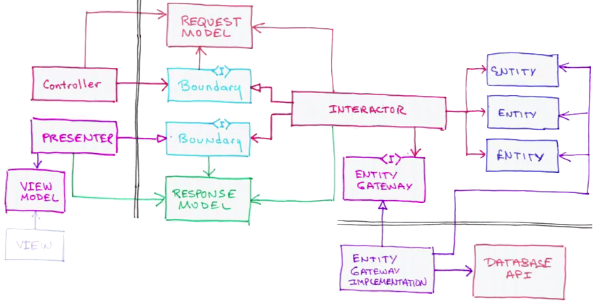

A project where I try to apply best practices about clean architecture, and also experiment a couple of things that are important to me but seem neglected almost everywhere.

## Clean Architecture
>[](https://youtu.be/WpkDN78P884?t=420)

Some resources about it:
* [conference](https://youtu.be/WpkDN78P884?t=420)
* [article](https://blog.cleancoder.com/uncle-bob/2012/08/13/the-clean-architecture.html)
* [book](https://www.google.com/search?q=clean+architecture+book)

## Specification & Implementation Assemblies

### "Specification" assemblies
Holding no implementation whatsoever, they provide the maintainers with a plethora of valuable information. :
* the API of the programmatic bricks of the code base
* the introduction to some terminology
* the behavior of these bricks under the shape of blackbox tests - that-is-to-say, what outputs are returned from given inputs. 
_Note that when I say inputs, I'm not restricting myself to method parameters. I'm talking about *all* the inputs, even if they come from a config file, a database, a server machine. These inputs would then be used in the test in the shape of self-describing strings._
* meaningful examples of the input and output parameters

In other words, if Project Owners were developers, here is where they'd write user stories, in the shape of interfaces to implement and blackbox tests to pass.

### "Implementation" assemblies
Holding the implementation of the related _"Specification" assembly_ and implement the abstract, blackbox tests in order to guarantee that the implementation satisfies its specification.

Yes, I know, that's mixing test code with production code, there are dependencies to the unit testing framework all over the place. I'm experimenting whether the pros beat the cons. Get over it.

## Architecture Decision Log
I also believe in [Architecture Decision Log](https://github.com/joelparkerhenderson/architecture_decision_record) and want to experiment with it.

Too often have I stumbled on a piece of code then wondered:
* "Why the hell was this piece of code designed that way?
* "Has the developers thought about doing this _that_ way instead? Or couldn't he at that time?"

I'll be using the [MADR template](https://github.com/adr/madr):
```markdown
# Use Markdown Architectural Decision Records

## Context and Problem Statement

We want to record architectural decisions made in this project.
Which format and structure should these records follow?

## Considered Options

* [MADR](https://adr.github.io/madr/) 2.1.0 - The Markdown Architectural Decision Records
* [Michael Nygard's template](http://thinkrelevance.com/blog/2011/11/15/documenting-architecture-decisions) - The first incarnation of the term "ADR"
* [Sustainable Architectural Decisions](https://www.infoq.com/articles/sustainable-architectural-design-decisions) - The Y-Statements
* Other templates listed at <https://github.com/joelparkerhenderson/architecture_decision_record>
* Formless - No conventions for file format and structure

## Decision Outcome

Chosen option: "MADR 2.1.0", because

* Implicit assumptions should be made explicit.
  Design documentation is important to enable people understanding the decisions later on.
		  See also [A rational design process: How and why to fake it](https://doi.org/10.1109/TSE.1986.6312940).
				* The MADR format is lean and fits our development style.
				* The MADR structure is comprehensible and facilitates usage & maintenance.
				* The MADR project is vivid.
				* Version 2.1.0 is the latest one available when starting to document ADRs.
```

## Problems solved by the projects
One step that has been very hard to me was to find a business need in order to build projects. I'm currently using katas from [the coding dojo KataCatalogue](https://codingdojo.org/KataCatalogue/) in order to create my projects.
